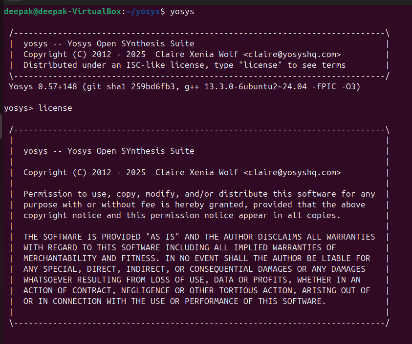
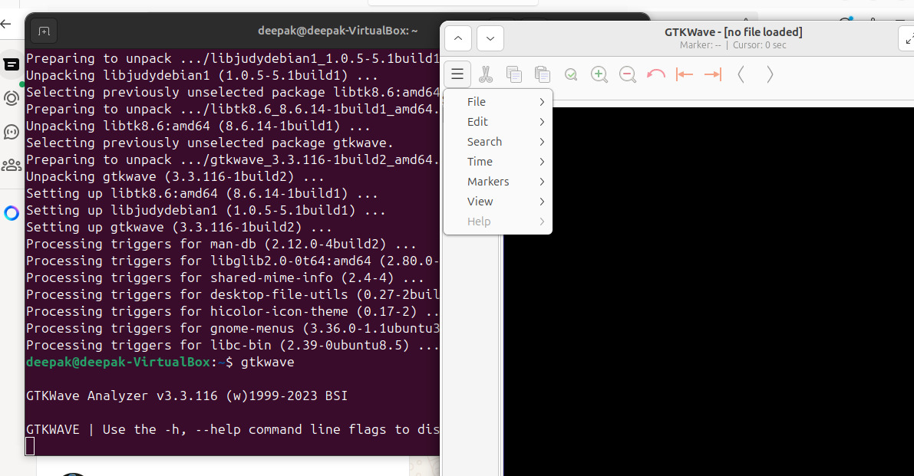
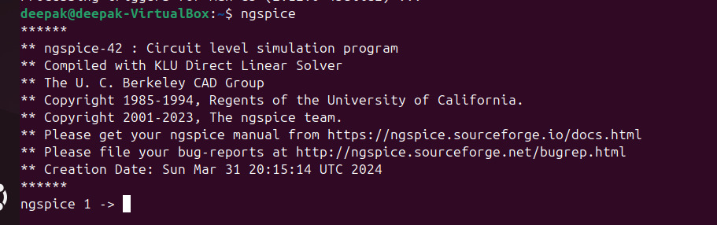
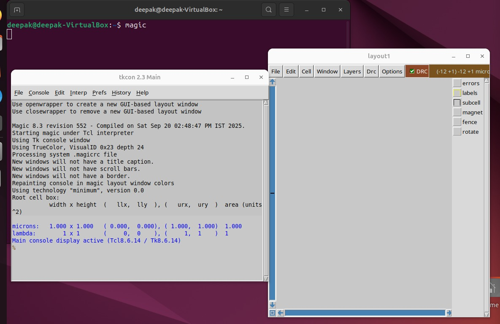

# 🚀 Essential VLSI Tools Installation Manual

Welcome, Innovator!  
Embark on your RISC-V SoC adventure with this vibrant, stepwise toolkit installation guide.  
**Every section below offers:**  
- 🎯 Simple install steps  
- 👁️ Visual confirmation (screenshot)  

---

<section>
<h2>1. 🌟 Yosys — The Digital Alchemist</h2>

**🔧 Install:**
```bash
sudo apt update
sudo apt install yosys -y
```

**🕵️ Test:**  
Run:
```bash
yosys
```
You’ll be greeted with:



</section>

---

<section>
<h2>2. 🧩 Icarus Verilog — Simulation Wizard</h2>

**🔧 Install:**
```bash
sudo apt install iverilog -y
```

**🕵️ Test:**  
Run:
```bash
iverilog
```
Expect this interface:


</section>

---

<section>
<h2>3. 🎛️ GTKWave — Waveform Explorer</h2>

**🔧 Install:**
```bash
sudo apt install gtkwave -y
```

**🕵️ Test:**  
Run:
```bash
gtkwave
```
Behold the waveform GUI:



</section>

---

<section>
<h2>4. ⚡ Ngspice — Analog Guru</h2>

**🔧 Install:**
```bash
sudo apt install ngspice -y
```

**🕵️ Test:**  
Run:
```bash
ngspice
```
You should see:



</section>

---

<section>
<h2>5. 🏰 Magic VLSI — Layout Creator</h2>

**🔧 Install:**
```bash
sudo apt install magic -y
```

**🕵️ Test:**  
Run:
```bash
magic
```
Marvel at the magic:



</section>

---

## 🏁 Grand Finale

- ✨ Fire up each tool, confirm it launches as pictured.
- 🦄 These tools are your companions for digital design, simulation, and silicon artistry.
- 🎉 **Happy taping out, and may your silicon always be bug-free!**

---
